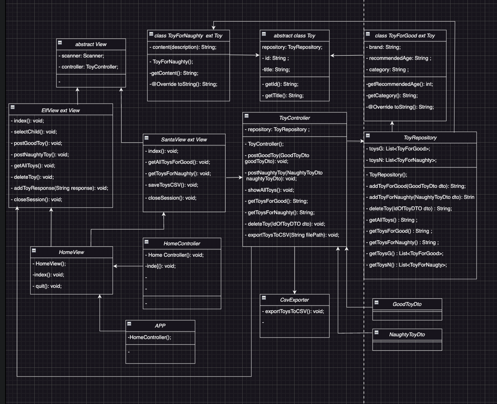

# Santa claus toy factory

A simple console-based application for managing and organizing toys, designed for two types of users: Santa Claus and Elves. The system allows the addition, deletion, and listing of toys for both "good" and "naughty" children. It also supports exporting toy data to a CSV file.

# Features

Elf User:

1. Add toys for good or naughty children.
2. View all toys.
3. Delete toys.
4. Log out.

Santa Claus User:

1. See list of good children's toy
2. See list of bad kids toys
3. Save list of all toys (format .csv)
4. Log out.

Home Interface:

1. Log in as an Elf.
2. Log in as an Santa.
3. Exit the system.

CSV Export:

Export all toys (good and naughty) to a CSV file with proper formatting.

# Technologies Used

Java 21: Core language for building the application.
JUnit: For unit testing of individual components.
Java Collections (ArrayLists for toy management)
File I/O (CSV Export)

# Installation

Download or clone this repository: git clone https://github.com/NepyAnna/santa_claus_toy_factory.git
Open the project in your code editor (e.g., VS Code).

# Class Diagram

# Tests

# Authors

NepyAnna 
